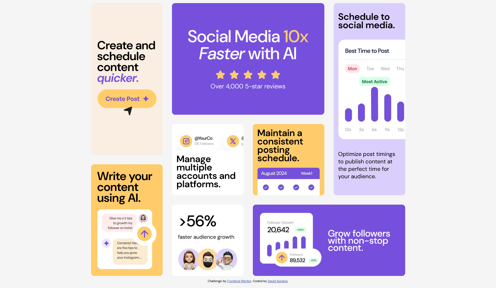
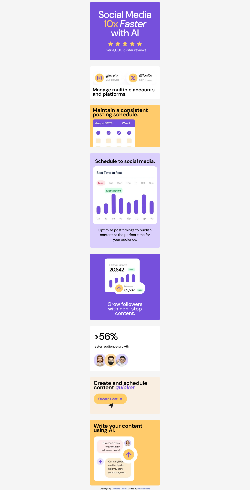

# 🧩 Frontend Mentor - Solución al reto *Bento Grid*

Esta es una solución al reto [Bento Grid en Frontend Mentor](https://www.frontendmentor.io/challenges/bento-grid-RMydElrlOj). Los retos de Frontend Mentor te ayudan a mejorar tus habilidades de programación construyendo proyectos realistas.

## 📑 Tabla de contenidos

- [🗂 Resumen](#-resumen)
  - [📌 El reto](#-el-reto)
  - [🖼️ Captura de pantalla](#️-captura-de-pantalla)
  - [🔗 Enlaces](#-enlaces)
- [🚀 Mi proceso](#-mi-proceso)
  - [🧱 Construido con](#-construido-con)
  - [📚 Lo que aprendí](#-lo-que-aprendí)
  - [🧠 Desarrollo continuo](#-desarrollo-continuo)
  - [🔍 Recursos útiles](#-recursos-útiles)
- [👨‍💻 Autor](#-autor)
- [🙏 Agradecimientos](#-agradecimientos)

---

## 🗂 Resumen

### 📌 El reto

Los usuarios deben poder:

- Ver el diseño óptimo de la interfaz dependiendo del tamaño de pantalla del dispositivo.

### 🖼️ Captura de pantalla

- Pantallas grandes (1440px)  
  

- Pantallas móviles (375px)  
  

### 🔗 Enlaces

- **URL del repositorio:** [Bento-Grid](https://github.com/David-Soriano/bento-grid)
- **Sitio en vivo:** [Github - Pages](https://david-soriano.github.io/bento-grid/)

---

## 🚀 Mi proceso

### 🧱 Construido con

- HTML5 semántico
- Propiedades personalizadas de CSS (variables)
- Flexbox
- CSS Grid
- Flujo de trabajo *mobile-first*

### 📚 Lo que aprendí

Durante este proyecto reforcé el uso de **CSS Grid** para crear diseños responsivos más avanzados. También practiqué el uso de variables personalizadas y la organización de componentes visuales en tarjetas reutilizables.
```html
<link rel="stylesheet" href="./css/desktop.css" media="(min-width: 1440px)">
```
```css
:root {
    --Purple-100: hsl(254, 88%, 90%);
    --Purple-500: hsl(256, 67%, 59%);
    --Yellow-100: hsl(31, 66%, 93%);
    --Yellow-500: hsl(39, 100%, 71%);
    --White-off: #F5F5F5;
    --White: hsl(0, 0%, 100%);
    --Black: hsl(0, 0%, 7%);
}
```
### 🧠 Desarrollo continuo
## Quiero seguir aprendiendo sobre:

- Accesibilidad

- Animaciones con CSS

- Buenas prácticas en responsive design

- Optimización del rendimiento

### 🔍 Recursos útiles

Documentación oficial de MDN Web Docs

### 👨‍💻 Autor
- Frontend Mentor - [@JDavid Soriano](https://www.frontendmentor.io/profile/David-Soriano)
- Linkedin - [@Juan David Soriano](https://www.linkedin.com/in/david-soriano-soft/)

### 🙏 Agradecimientos
Gracias a Frontend Mentor por proporcionar retos prácticos que ayudan a mejorar mis habilidades como desarrollador web. También a la comunidad por compartir soluciones e ideas que inspiran.
